# GIt&GitHub仓库备份笔记流程

## 步骤1：安装Git 

1. Git官网下载地址：

    https://git-scm.com/download/win

2. 点页面里的 Download Windows，下载最新64位安装包

3. 双击exe安装，

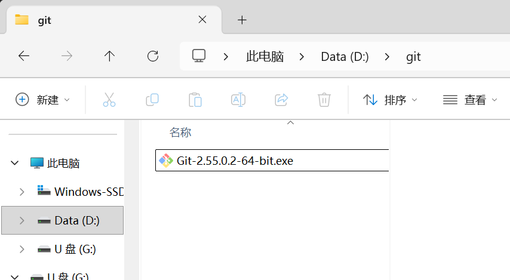

4.点击next

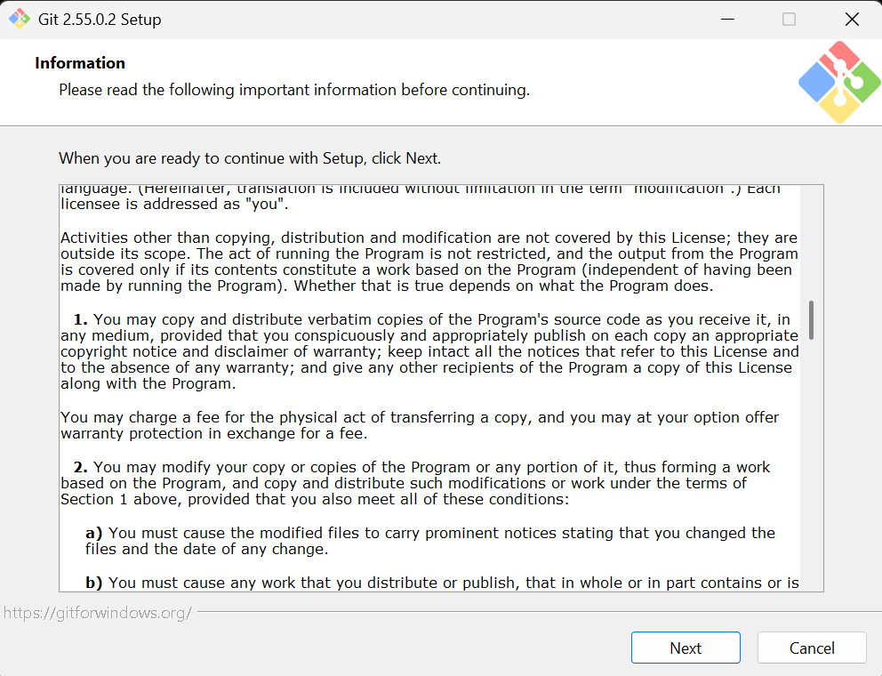

5.选择文件位置

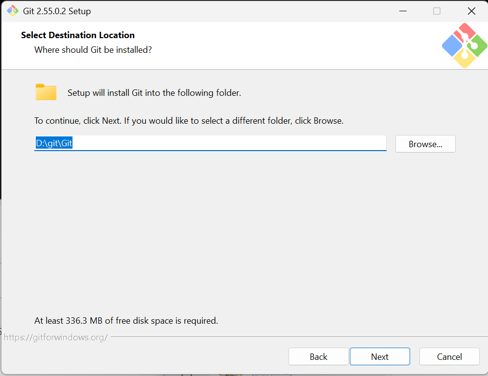

Next

6.默认设置

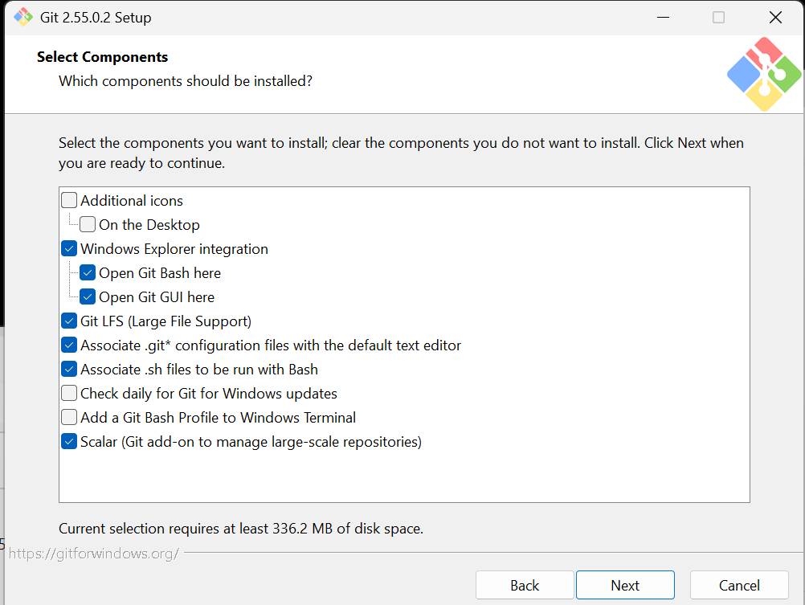

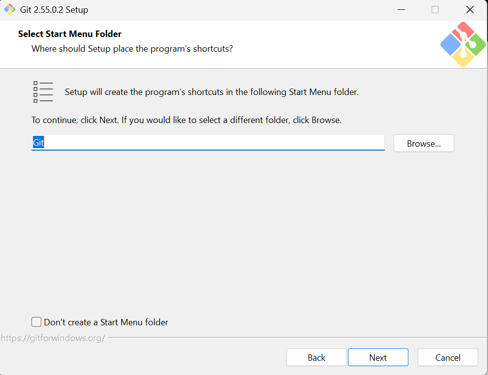

7.选择VScode作为编译器（或者其他的）

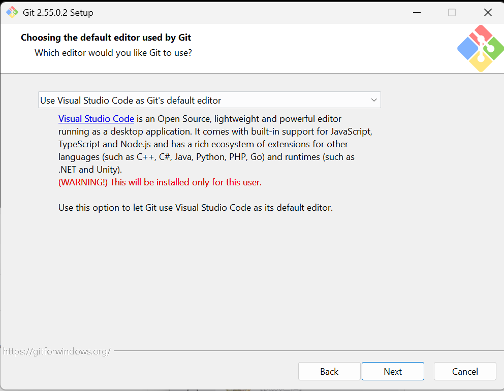

8.下一个选第二个

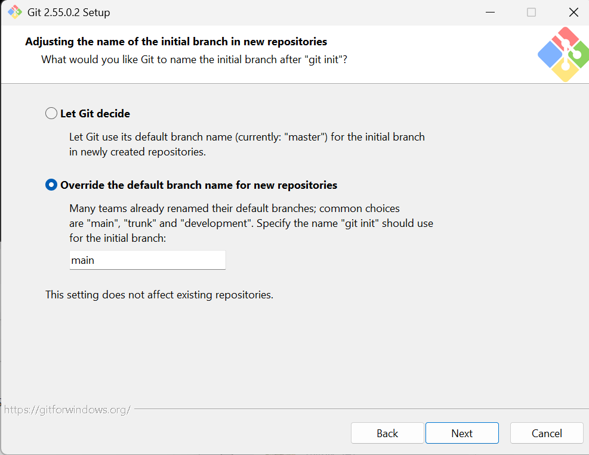

9.后面都是默认设置点击安装

安装完成之后

**点击第一个**

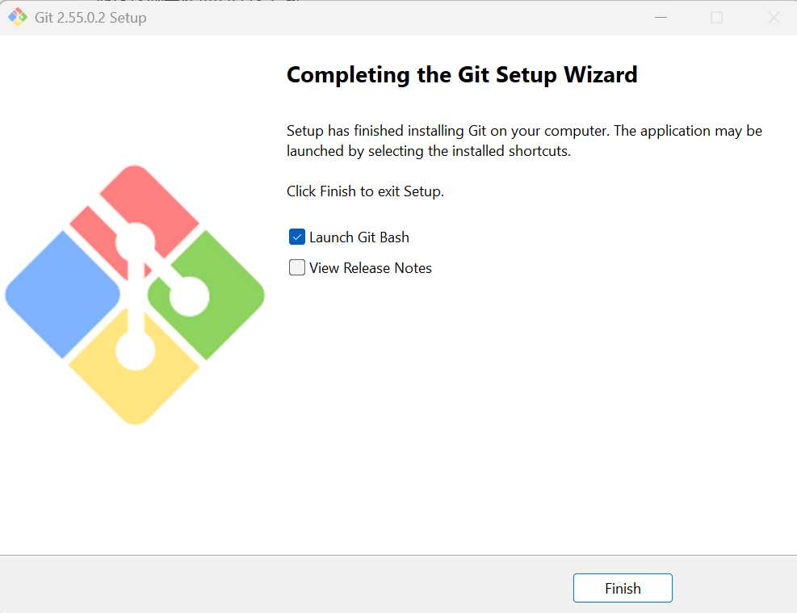

finish

10.就会出现小弹窗

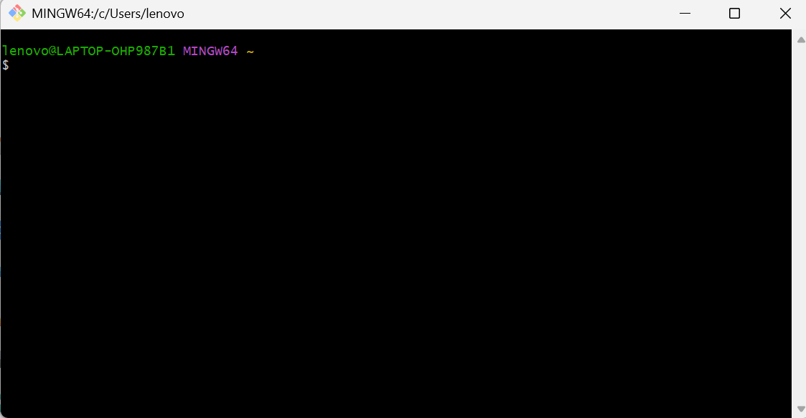

开着，先不管它

## Github注册账号

**1.浏览器输入**

    ww.github.com

**2.注册账号**

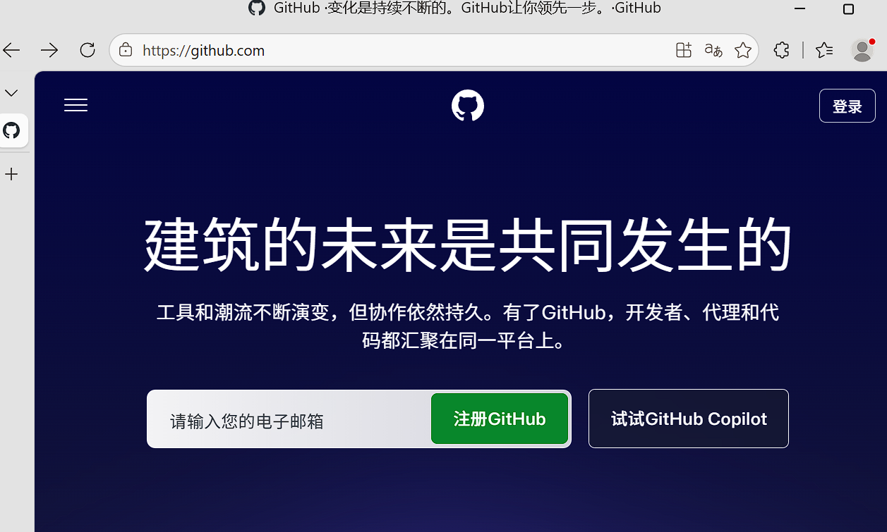

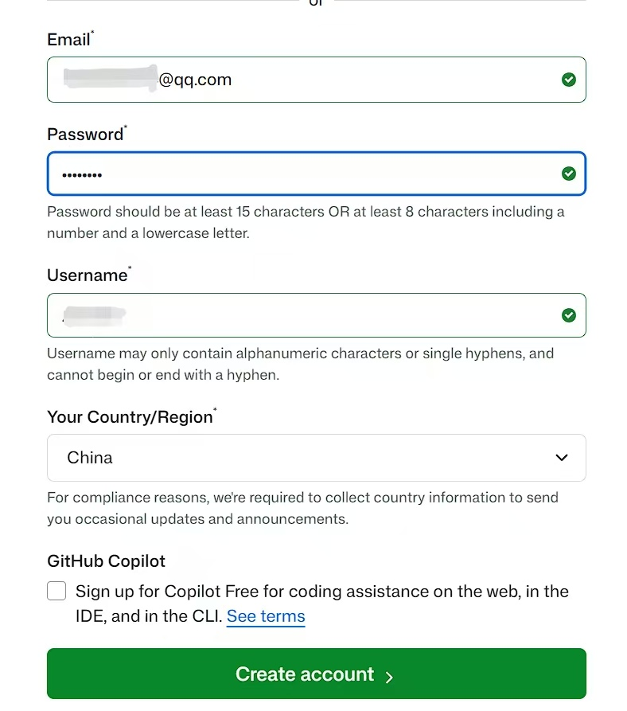

输入你的用户名，你的邮箱等信息，记住。

不用勾选最下面的

Create account

3.等待验证码，输入

如果返回网页，在注册账户，发现Email下方有一段小字，提示你这个邮箱已绑定账户，直接登录就好了。

## 本地文件夹绑定远程GitHub仓库

**1.设置Git全局变量**

打开刚才的小弹窗输入下面几行。

    git config --global user.name "你的用户名"

    git config --global user.email "你的邮箱"

    git config --global --list

*注：写一行，回车之后再写一行*

*注：粘贴的话，直接点击鼠标右键就可以了，这个弹窗不支持Ctrl+V*

*注：如果是手打的话：git （空格）config （空格）（两下减号键）--global （空格）user.name （空格）"你的用户名"*

**2.设置SSH密钥**

在弹窗中输入

     ssh-keygen -t ed25519 -C "你的邮箱"

点击三下回车键

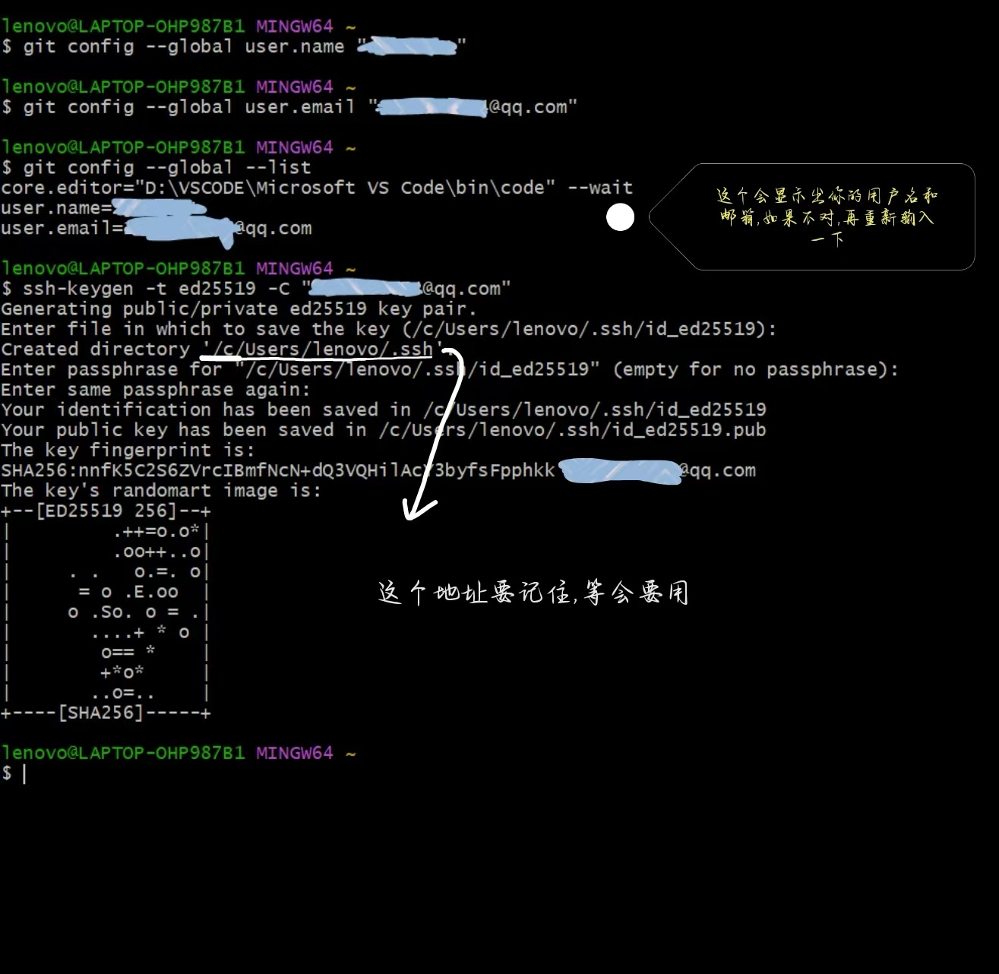

**3.打开上图中的地址**

里面有两个文件：
 
-  id_ed25519 ：私钥，绝对不要复制、不要发给任何人

-  id_ed25519.pub ：公钥文件，右键 → 打开方式 → 记事本打开
 
 把记事本里从头到尾全部文字完整复制（开头以ssh-ed25519开头，末尾是你的邮箱，全部都要选上，不能漏字符）

**4.打开Github网站**

- 点击头像，打开设置图标（setting）

- 打开SSH和GPG keys

- 设置新的SSH密钥

- 在大的输入框里粘贴3中复制的东西

- 标题可以随便起（例如：用户名+SSH

**5.打开小弹窗**

*注：小弹窗可以随便点击一个文件夹，按住Shift+右键，点击Open Git Bash here*

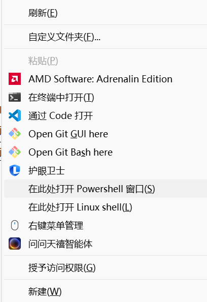

     输入ssh -T git@github.com

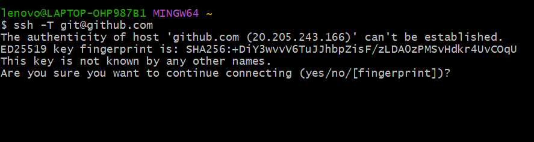

这段话意思是：第一次连接github主机，询问你要不要信任这个主机指纹，输入yes确认信任，后续就不会再弹这个提示了。

yes+回车

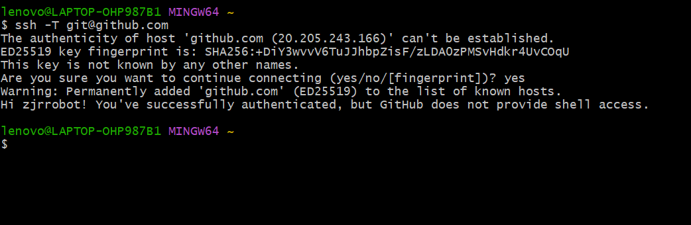

完成。

**6.在网页上创建一个新仓库**

- 打开Github网页

- 创建一个新仓库。

- 填仓库名（纯英文，不要中文空格），描述随便写

- 不要勾选 Add a README file（选空白仓库），拉到最下面点 Create repository

**7.中间蓝色方块中切换到SSH标签，复制**

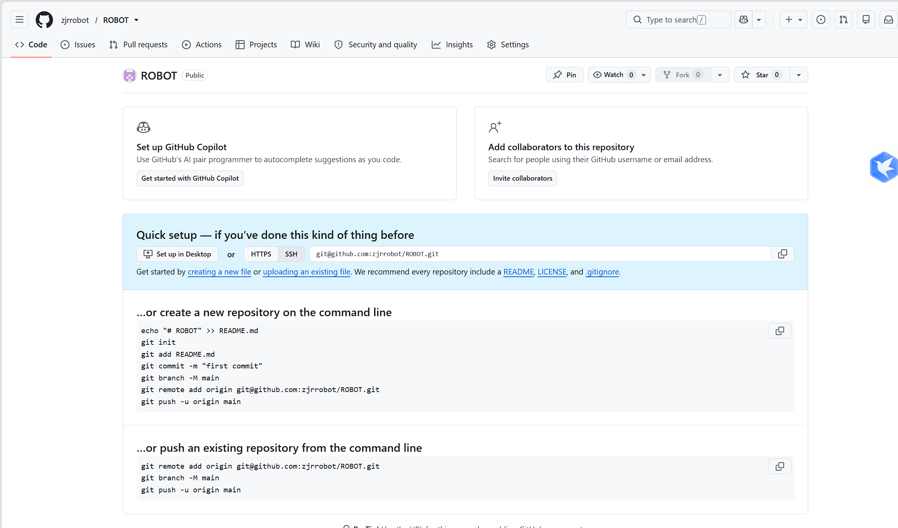

**8.建立存储笔记的文件夹**

- 先新建一个空白文件夹，比如取名  ROBOT ，点进去进入文件夹内部（地址栏显示的是这个文件夹路径）

- 在文件夹空白的地方按住Shift键不放 + 鼠标右键单击空白处

- 右键菜单里就会多出两项：Git Bash Here、Open Git GUI Here点 Git Bash Here，弹出的终端当前路径就自动定位到这个文件夹了，不用cd切换路径，直接输命令就行。

- 按下面一行输完敲一次回车，严格按顺序来，不要跳步：
 
     1. 先初始化仓库（必须第一步）在弹窗中输入：

             git init

     执行完会生成隐藏的  .git  文件夹
    
     2. 生成一个README文件（不然空仓库没法提交）

            echo "# ROBOT competition project" >> README.md

     3. 把当前所有文件加入暂存

         git add .
         
     4. 提交到本地仓库

         git commit -m "init robot project"

     5. 绑定GitHub远程仓库

          git remote add origin +你复制的7.的内容
         
     6. 第一次推送到远程main分支

         git push -u origin main

 
补充注意点
 
- 必须等上一条命令跑完、回到  $  提示符再输下一条；

- 中途只要出现  fatal: not a git repository ，就说明前面没成功跑完  git init ，重新输一遍这条；

报错：

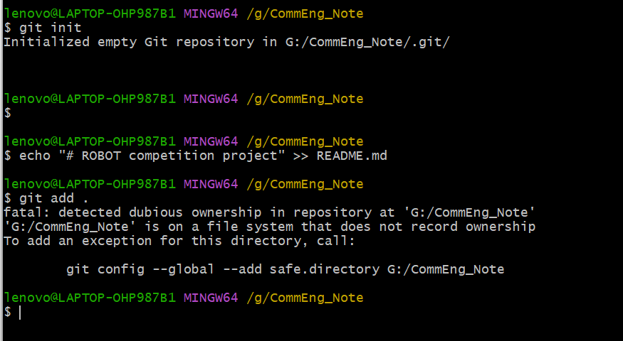

解决：

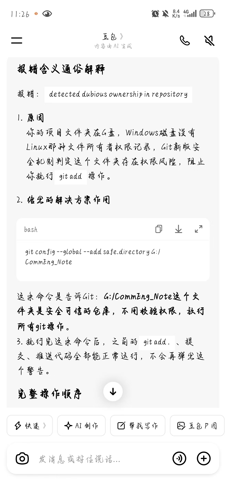

**完整过程：**

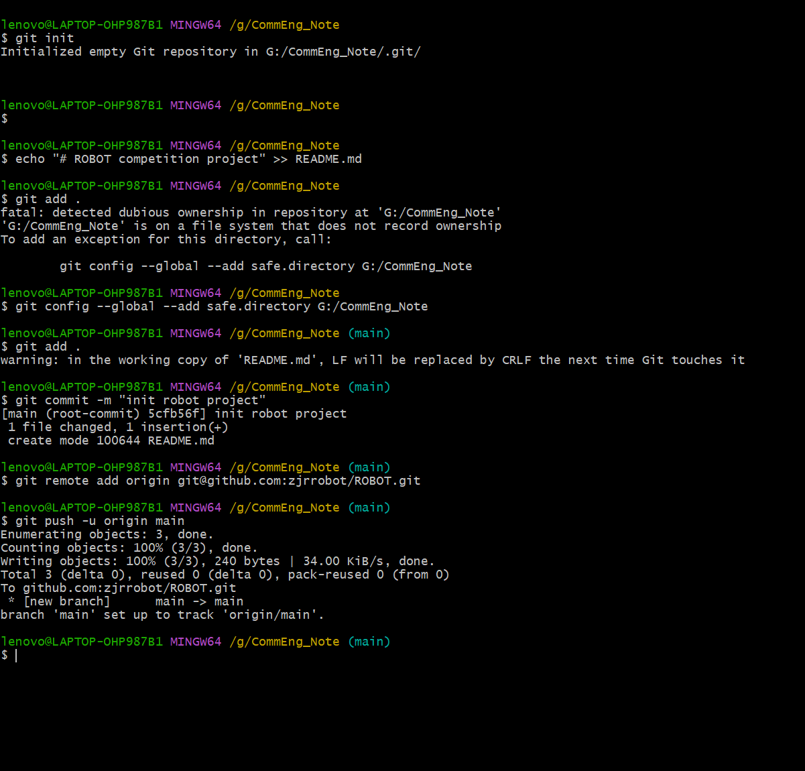

**9.测试一下**

新建一个markdown文件，输入一些文本，保存。

在弹窗中输入

    git add .

    git commit -m "自定义本次更新说明"

    git push

流程如下：

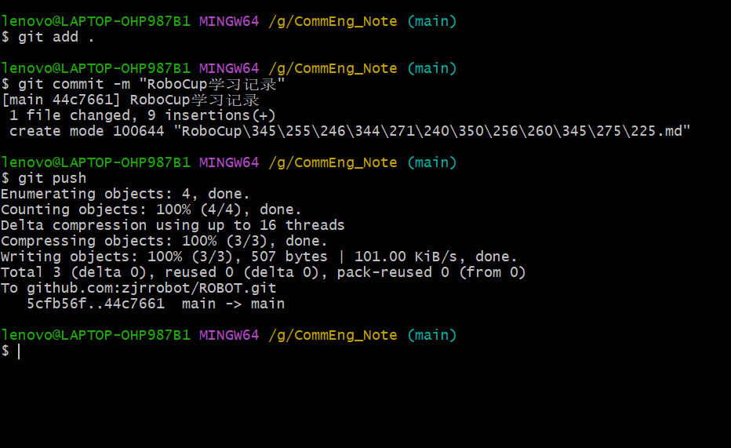

展示笔记如下：

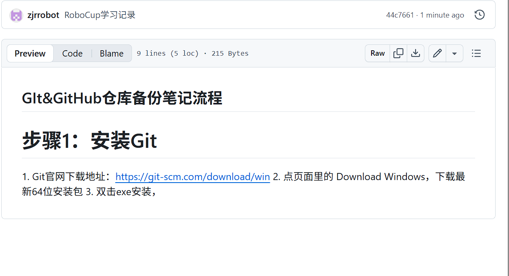

