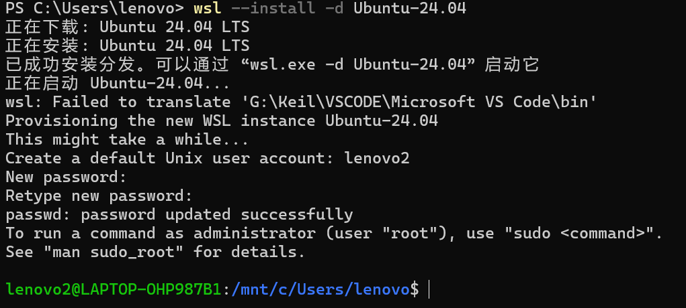
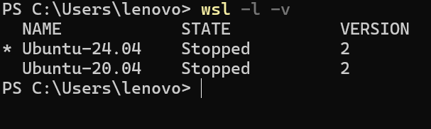
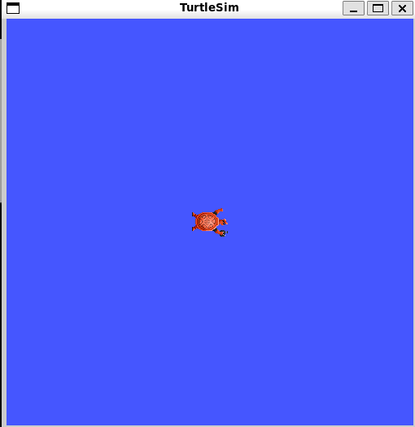
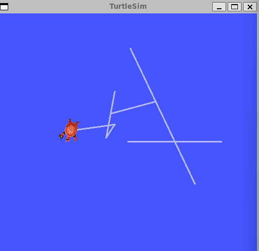

# 配置操作系统

## 打开终端

右键点击开机键

**打开终端（管理员）**

## 下载Ubuntu

在终端中输入

     wsl --install -d Ubuntu-24.04

*注：在终端中可以Ctrl+V*

要设置用户名，密码，确认密码。

用户名要与Ubuntu-20.04区别开。

再重新打开终端

输入
    
     wsl -d -install Ubuntu-20.04

再重新打开终端

输入

     wsl -l -v

出现上述情况就是安装好了。

## 整套部署过程：WSL‑Ubuntu24.04 + ROS2‑Jazzy + Python虚拟环境(venv)+VSCode配置

 
**步骤1：Ubuntu系统换清华源（WSL内部终端执行）**
 
1. 备份原来的源文件
 

  
    sudo cp /etc/apt/sources.list /etc/apt/sources.list.bak
 
 
2. 替换24.04清华镜像源，更新软件列表
 

  
    sudo sed -i 's/archive.ubuntu.com/mirrors.tuna.tsinghua.edu.cn/g' /etc/apt/sources.list
    sudo apt update && sudo apt upgrade -y
 
 
**步骤2：安装ROS2‑Jazzy（严格按照官方步骤）**
 
1. 安装依赖工具
 

  
    sudo apt install software-properties-common
    sudo apt install locales
    sudo locale-gen en_US en_US.UTF-8
    sudo update-locale LC_ALL=en_US.UTF-8 LANG=en_US.UTF-8
    export LANG=en_US.UTF-8
 
 
2. 添加ROS2软件源
 

  
    sudo apt install curl
    sudo curl -sSL https://raw.githubusercontent.com/ros/rosdistro/master/ros.key -o /usr/share/keyrings/ros-archive-keyring.gpg
    echo "deb [arch=$(dpkg --print-architecture) signed-by=/usr/share/keyrings/ros-archive-keyring.gpg] http://packages.ros.org/ros2/ubuntu $(lsb_release -cs) main" | sudo tee /etc/apt/sources.list.d/ros2.list > /dev/null
    sudo apt update
 
 
3. 完整安装ROS‑Jazzy桌面版（推荐，包含rviz、gazebo、rqt全部工具）
 

  
     sudo apt install ros-jazzy-desktop -y
 
 
4. 设置环境变量，每次终端自动加载ros2
 

  
     echo "source /opt/ros/jazzy/setup.bash" >> ~/.bashrc
     source ~/.bashrc
 
 
5. 验证ROS2安装成功
 

  
     ros2 --version
 
 
**步骤3：创建ROS2工作空间 robot_ws**
 

  
     mkdir -p ~/robot_ws/src
     cd ~/robot_ws
 
 
**步骤4：创建Python独立虚拟环境（重点，隔离系统Python）**
 
目的：不在系统全局安装numpy，防止版本冲突，专门给机器人项目使用
 
1. 在工作空间内部创建venv环境
 

    cd ~/robot_ws
    sudo apt install python3-venv
    python3 -m venv venv
 
 
2. 激活虚拟环境（之后安装numpy全部在这里）
 

  
    source venv/bin/activate
**激活成功前缀会出现 (venv)**
 
 
3. 在虚拟环境里升级pip，安装numpy
 

  
     pip install numpy==2.5.1
 
 
4. 验证numpy安装（Python交互环境测试）
 

  
    python3
    import numpy
    print(numpy.__version__)
**输出2.5.1即安装成功**

    exit()
 
 
- 注意：ROS2的rclpy依然来自系统 /opt/ros/jazzy ，虚拟环境可以正常调用ROS2库。
 
**步骤5：编译自定义ROS2功能包**
 
1. 在src目录创建你的功能包（示例my‑pkg）
 

  
    cd ~/robot_ws/src
    ros2 pkg create --build-type ament_python my_pkg
 
 
2. 返回工作空间编译代码
 

  
     cd ~/robot_ws
*激活环境*

     source venv/bin/activate
     source /opt/ros/jazzy/setup.bash
     colcon build

*编译完成后加载自己的包*

     source install/setup.bash
 
 
**步骤6：VSCode配置开发环境（Windows端）**
 
1. WSL终端打开工作空间
 

  
     cd ~/robot_ws
     code .
 
 
2. VS‑Code安装插件：- Python（微软官方）
- ROS2 Extension
- C/C++、CMake‑Tools

3. 选择解释器：

Ctrl+Shift+P选择解释器路径： /home/lenovo2/robot_ws/venv/bin/python3 

选完之后代码里 import rclpy 、 import numpy 不会报红。
 
**步骤7：日常启动命令（之后每次写代码固定执行）**
 

  
     cd ~/robot_ws
     source venv/bin/activate          #启用虚拟环境，加载numpy
     source /opt/ros/jazzy/setup.bash  #加载系统ROS2环境
     source install/setup.bash         #加载自己写的包
 
 
**步骤8：验证ROS2仿真（海龟测试，整套环境可用）**
 
Ubuntu终端输入：
 

  
     ros2 run turtlesim turtlesim_node
 
 
新开Ubuntu终端，同样激活环境执行：
 

  
     ros2 run turtlesim turtle_teleop_key
 
 
可以操控海龟，说明ROS2整套环境配置完毕。
 
 
 

