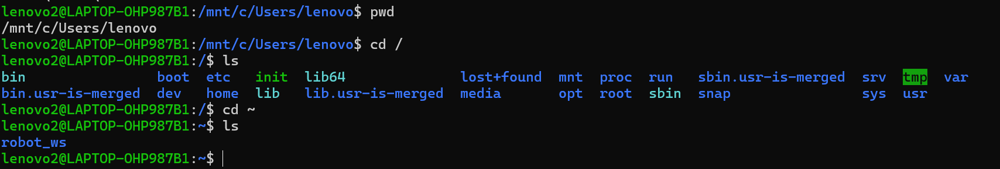
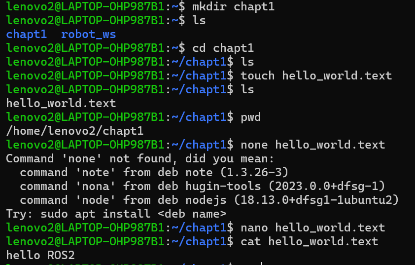
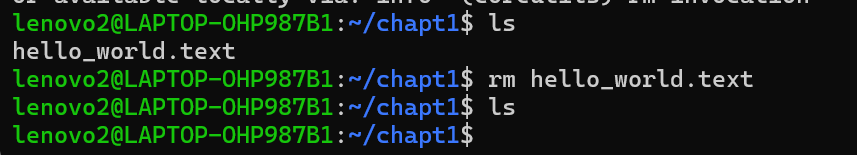
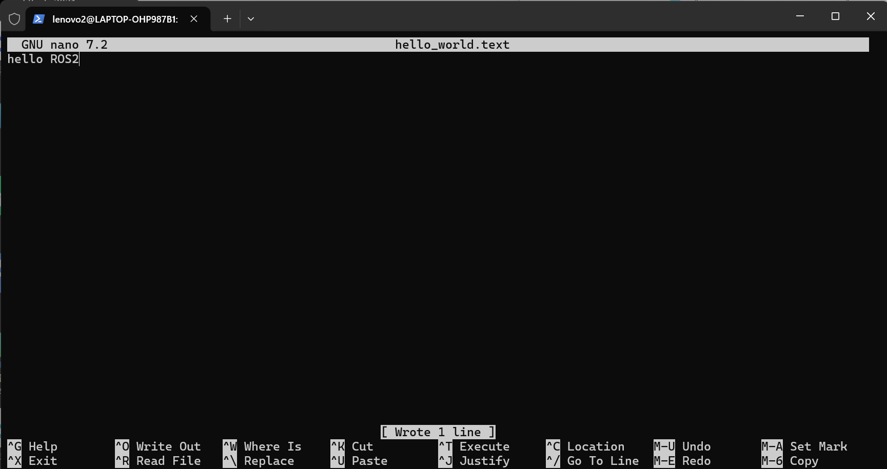
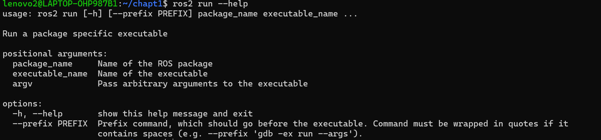

# Linux终端操作

## 对目录操作
**当前终端目录**

     pwd

**从当前进入到根目录**

     cd /

**查看当前目录下的文件**

     ls
**查看主目录内**

     cd ~

     ls

完整操作如下：

## 对文件操作

**进入主目录**

     cd ~

**在主目录下创建 chapt1 文件夹**

     mkdir chapt1

**从主目录进入 chapt1**

     cd chapt1

**创建空白文件**

     touch hello_world.txt

**查看当前路径**

     pwd

**查看 chapt1 目录下所有文件**

     ls

**查看文件内容和删除文件**

     cat hello_world.txt

     rm hello_world.txt

完整操作如下：

- 补充：

      nano hello_world.text

   此指令可以直接编辑文档

ctrl+O 保存

ctrl+X 退出

## 帮助

**如果忘记指令如何使用**

可以在指令后输入--help

例如：

其中usage后面就是它的用法。

**查看历史指令**

      history

就可以看到你的以前所有的指令。

