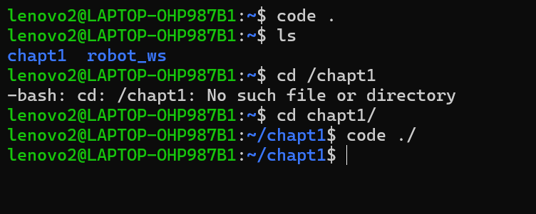
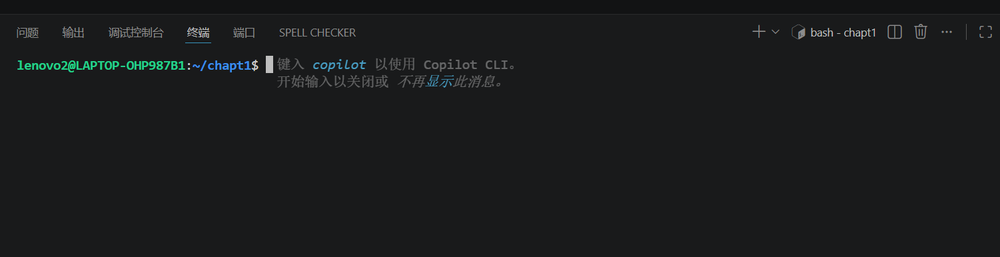
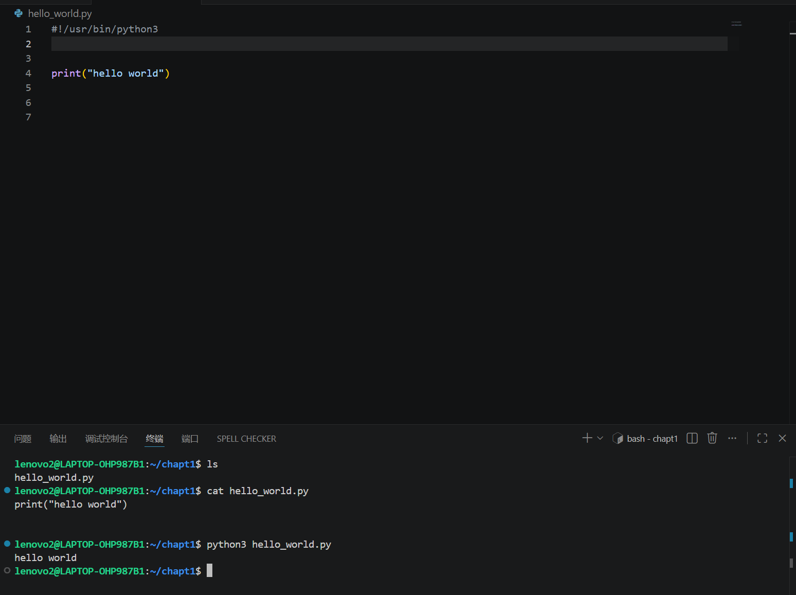
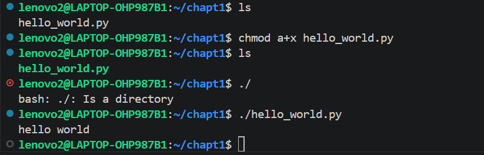

# 在Linux中编写python代码

**1.打开VScode**
   
   

**2.在VScode新建文件**

命名为hello_world.py文件(文件后缀可加可不加)

在最上方的文件中点击自动保存。

在资源管理器中，右键点开在“集成终端中打开”，就可以在终端中操作了

 

 **3.执行文件**

  

  用python3执行脚本

  *具体指令见图片。*

**4.赋予执行权限**

清空当前聊天内容

     clear

赋予执行权限

     chmo (文件名)

直接执行文件

     ./ (文件名)