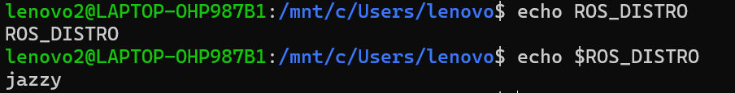
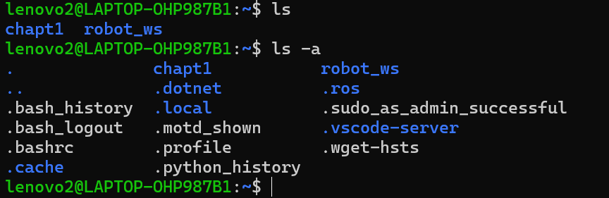

# 环境变量

## 类型

   **1.临时环境变量**

      export NEMA="hello"

 - export 改变环境变量的值
 - 只在当前这个终端中生效
  
  **2.永久环境变量**

     nano ~/.bashrc

- 在这个文件末尾添加export语句，ctrl+O保存，ctrl+x退出

在执行下面命令生效

     source ~/.bashrc
## 查看环境变量

**echo 输出打印**

     echo ROS_DISTRO

     echo $ROS_DISTRO

- echo $(环境变量)读取他的内容
  
  

**printenv 打印所有环境变量**

      printenv

- 可以看到全部永久环境变量
  
## 如何运行执行文件？

     ros2 run turtlesim turtlesim_node 

- ros2 run +可执行文件 +可执行功能包

 
ros2 run过程：

  1. 找到AMENT_PREFIX_PATH
  2. 找到lib/package_name/exauteable_name 
       (功能包名字/可执行文件名字)
  3. 执行文件
   
我们也可以试一下
   
     printenv | grep AMENT 

- 对前面的内容进行过滤，过滤出AMENT，也就是找到变量AMENT_PREFIX_PATH
- 用export 改变环境变量的值
- 再用ros2 run turtlesim turtlesim_node就运行不了了。
-  弹出报错:Package "turlesim" not found ，它的意思就是文件的功能包，可执行文件位置被改变，
-  以后有这个报错，就可以找AMENT_PREFIX_PATH环境变量的值，看它是不是改变了。
## 那AMENT_PREFIX_PATH环境变量的值是被谁，如何设置出来的呢?

**默认脚本：~/.bashrc**

- 脚本（script）：就是把一堆Linux命令写到一个文件里，以后运行这个文件，系统会自动依次执行里面的命令，不用手动一条一条敲代码。
- 在Linux中，以.开头的文件或文件夹是隐藏文件
  
   

显示隐藏文件

      ls -a 

打开文件

     cat ~/.bashrc   

最后一行：source /opt/ros/jazzy/setup.bash 就是自动设置环境变量的文件

**验证：**

可以尝试用

     nano .bashrc 
     
打开文件，将最后一行注释掉。

然后观察AMENT_PREFIX_PATH这个环境变量

就会发现它是一个空白

printenv发现环境变量少了很多。

- 要新开一个终端观察AMENT_PREFIX_PATH这个环境变量
- 因为这个终端在我们注释完成前就已经设置好这个环境变量了
- 最后要记得改回来。