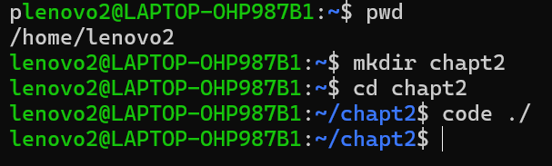
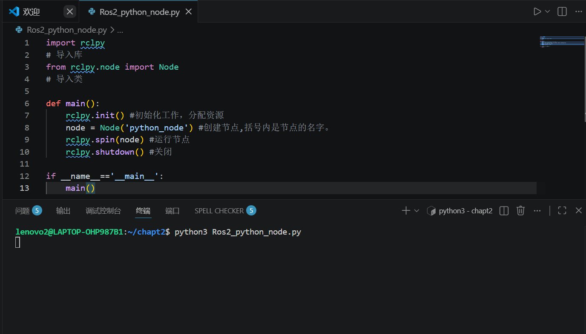
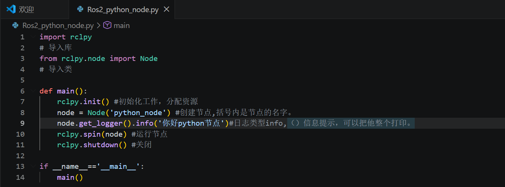
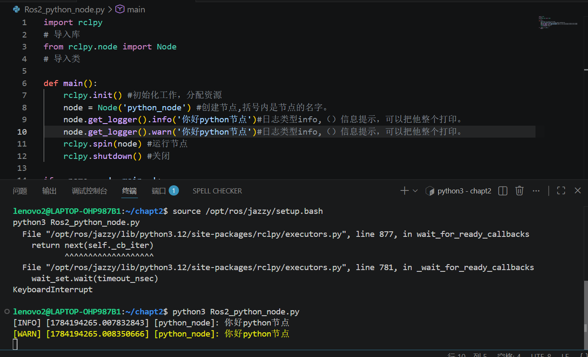
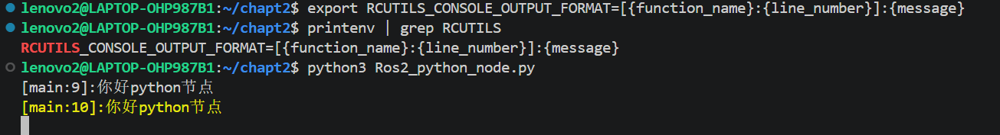

# 编写第一个节点
## 1.新建一个Python文件

**打开VScode**

下载python插件

**编写程序：**

- 如果rclpy被标出，rclpy 是ROS2自定义库名称，不属于常规英文单词，拼写插件识别不到就给出黄色警告，对程序没有影响。
- 如何去掉？
1. 鼠标悬浮在黄色警告上；
2. 点击  Add:rclpy to user setting ，把 rclpy 加入拼写白名单，警告消失。

## 打开集成终端

**运行程序**

     python3 Ros2_python_node.py

**再打开一个集成终端Ctrl+shift+5**

查询系统中节点的列表

      ros2 node list

- 如果没有显示，先输入CTRL+C结束程序
- 然后在第一个终端中输入
  
      source /opt/ros/jazzy/setup.bash
      python3 Ros2_python_node.py
- 在第二个终端中输入
  
      source /opt/ros/jazzy/setup.bash
      ros2 node list

然后就会输出节点的名字/python_node。

## 修改代码

运行：

     python3 Ros2_python_node.py
- 要关闭正在运行的，然后再运行新的。
- 关闭是ctrl+c.
  
## 环境变量修改日志

**什么是日志？**

最下面两行：

[日志级别] [时间戳：1970年到当前时间经历的秒数] [节点名字] [打印内容]

就是日志。

如何修改？

输入指令

      export RCUTILS_CONSOLE_OUTPUT_FORMAT=[{function_name}:{line_number}]:{message}

再运行

