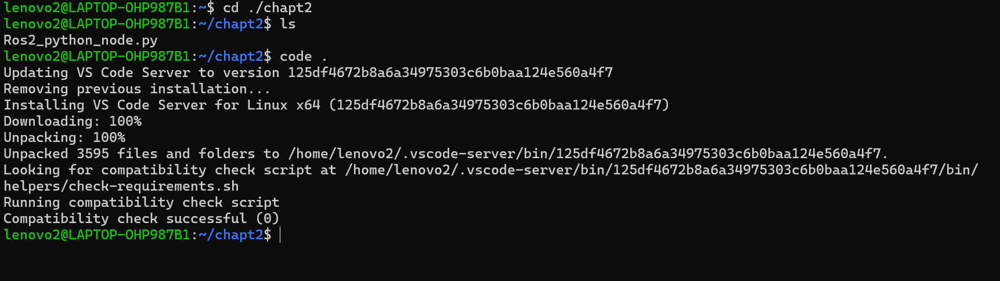
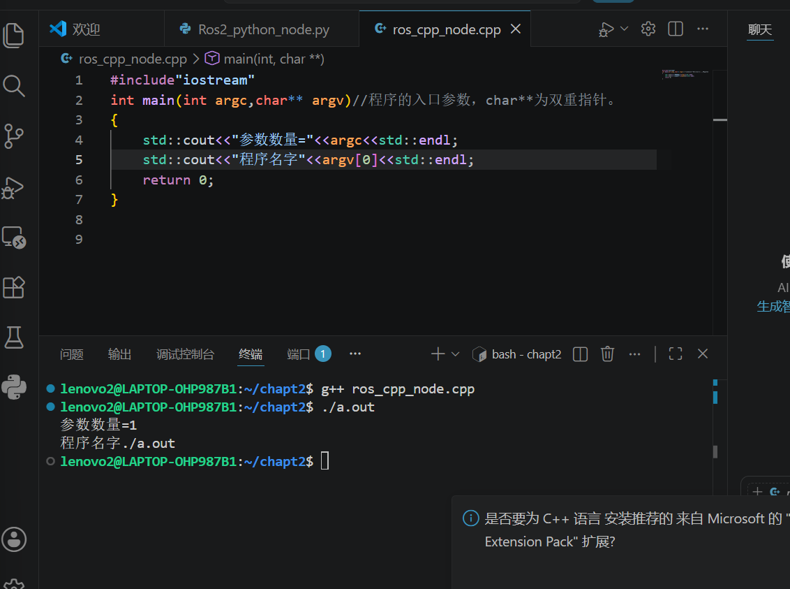
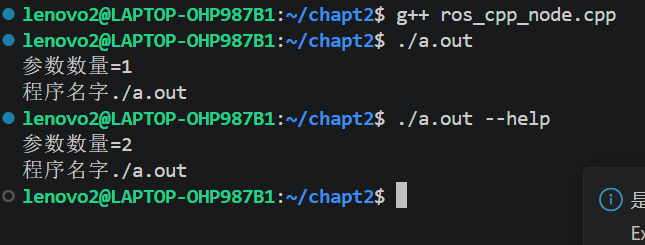
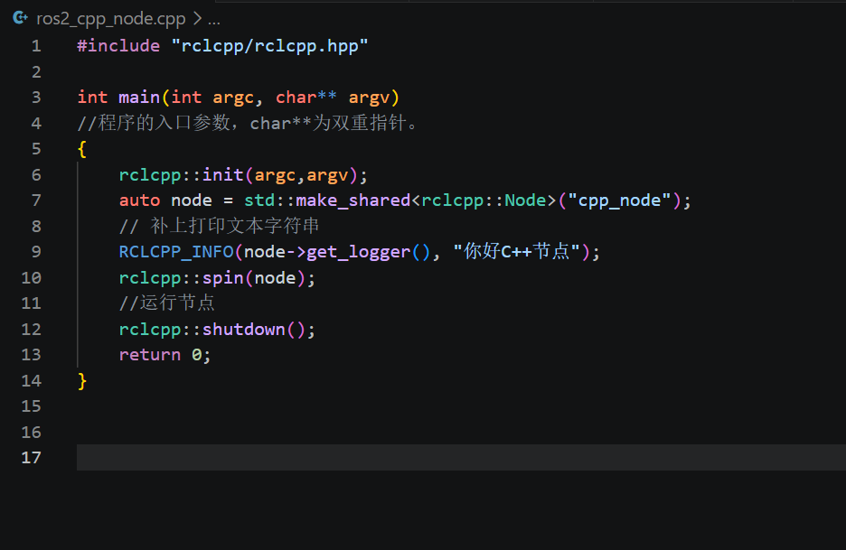
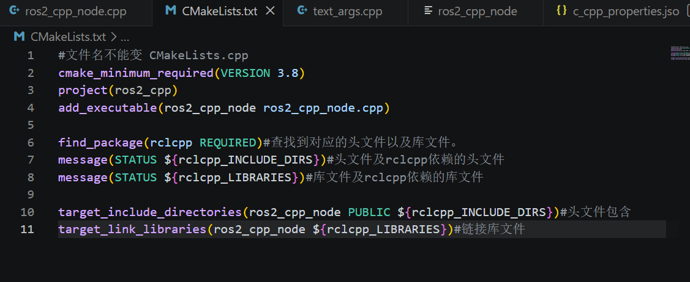
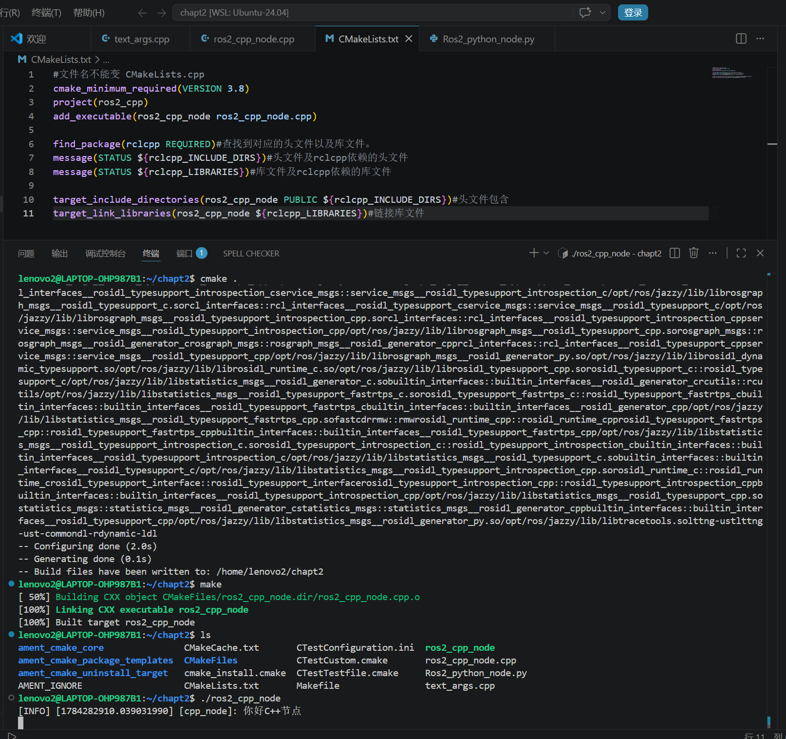
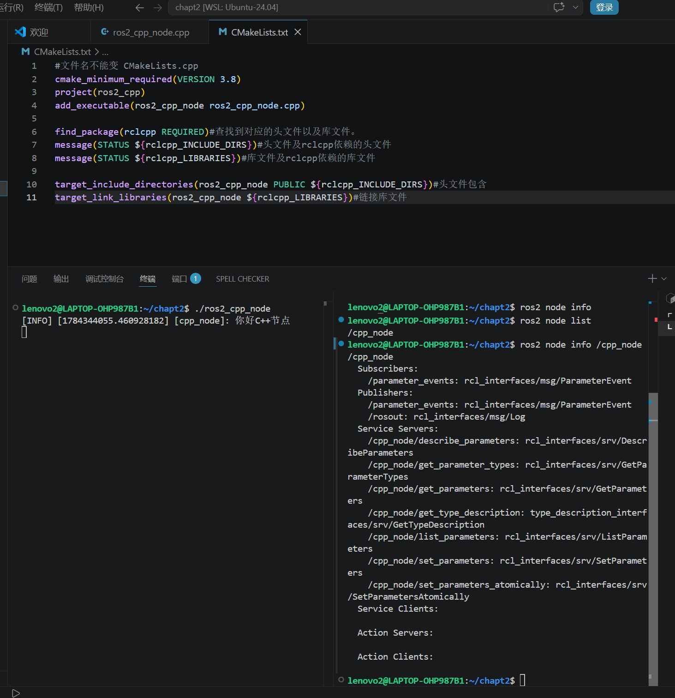

# 编写第一个C++节点

## 1.安装插件

## 2.新建文件ros_cpp_node.cpp

打开chapt2

新建文件如下：

参数变化原理
 
 argc  = argument count（参数总个数）
 argv  = argument vector（参数数组，存所有输入内容）
规则：程序自身文件名永远是第1个参数  argv[0] 
 
1. 输入  ./a.out 
 
终端完整指令拆分：
 
./a.out  →  argv[0] 
无其他内容
 
-  argc = 1 
 
2. 输入  ./a.out --help 
 
终端完整指令拆分：
 
./a.out  →  argv[0] 

 --help  →  argv[1] 
一共2段内容
 
-  argc = 2

## 3.新建文件text_args.cpp

text_args.cpp文件与ros_cpp_node.cpp基本一致。

修改ros_cpp_node.cpp的内容为

## 4.新建文件CMakeLists.txt

## 5.创建可执行文件

输入指令

     cmake .

     make

     ls

     ./ros2_cpp_node

一行一行输。

结果如下：

新开一个终端，看看是否可以正常运行。

查看节点内容：

      ros2 node info /cpp_node/cpp_node
      
## 报错解决

在ros_cpp_node.cpp文件，如果头文件变红

1. Ctrl+Shift+P 输入  C/C++: Edit Configurations (UI) ；
2. 往下找到包含路径(Include path)一栏，填入下面内容：

      ${workspaceFolder}/**
     /opt/ros/jazzy/include/**

3. 保存配置文件，重启VS‑Code， #include <rclcpp/rclcpp.hpp> 红色波浪线就消失。
