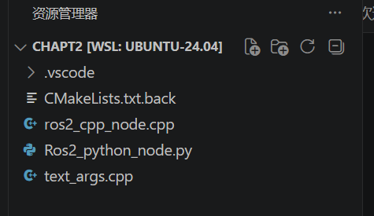
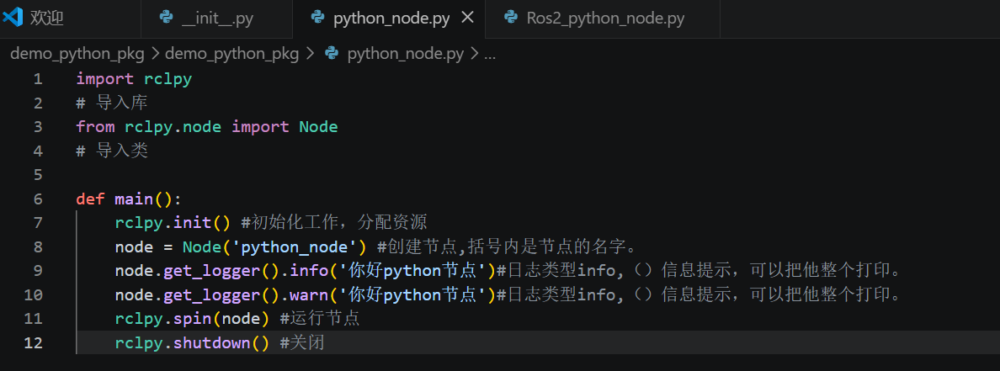
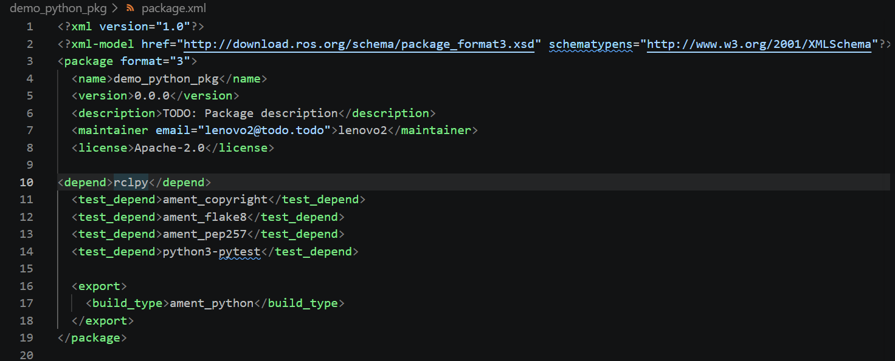
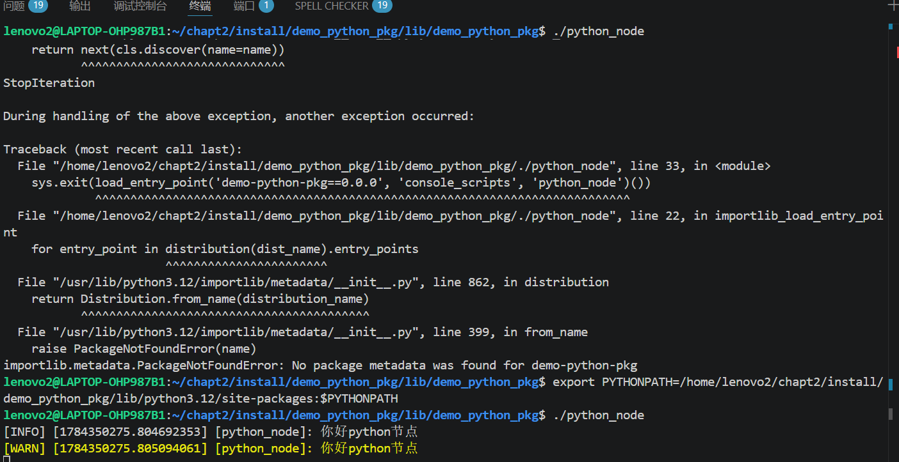
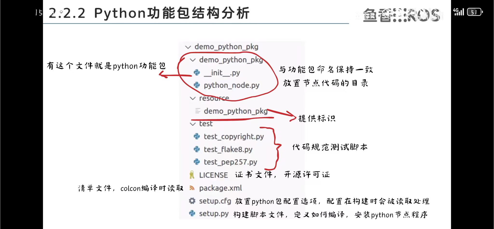

# 构建python功能包
## 1.删除文件

1. 打开chapt2

2. 删除文件至下图：

## 2.创建功能包

发送以下指令：

      ros2 pkg create --build-type ament_python --license Apache-2.0 demo_python_pkg

## 3.在demo_python_pkg的demo_python_pkg中新建一个python_node.py文件(这个文件就是节点文件)

python_node.py文件具体内容如下：

## 4.注册

在demo_python_pkg的setup.py中修改
     entry_points={
            'console_scripts': [
            'python_node=demo_python_pkg.python_node:main'
        ],

## 5.+依赖声明

在下图文件中加入

      <depend>rclpy</depend>

## 6.构建

终端输入

      colcon build

它运行的是~/chapt2/install/demo_python_pkg/lib/python3.12/site-packages/demo_python_pkg的python_node.py文件

打开install/demo_python_pkg/lib/demo_python_pkg可以看到有一个可执行文件。
直接运行不了， 
是环境变量出了问题

法1.按下图打开终端。
临时修改环境变量。

      export PYTHONPATH=/home/lenovo2/chapt2/install/demo_python_pkg/lib/python3.12/site-packages:$PYTHONPATH

运行：

      ./python_node 

法2.自动修改

打开~/chapt2终端

在:~/chapt2中输入 

      source install/setup.bash

帮我们修改环境变量

运行：

     ros2 run demo_python_pkg python_node

## python功能包结构分析

