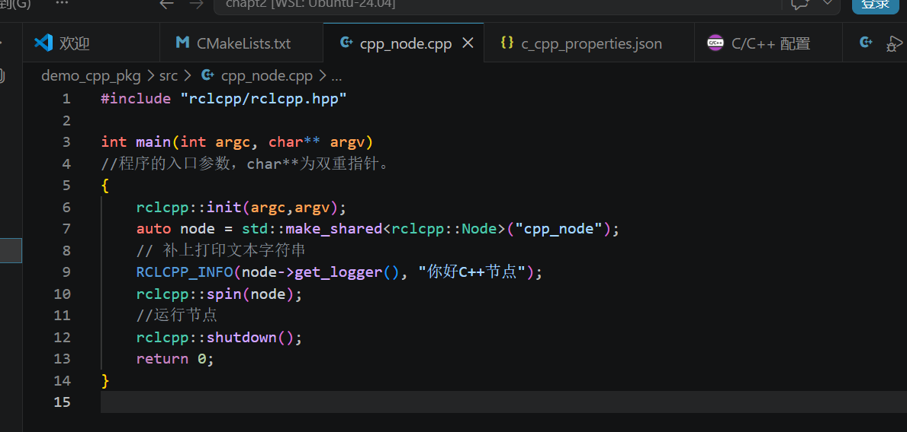
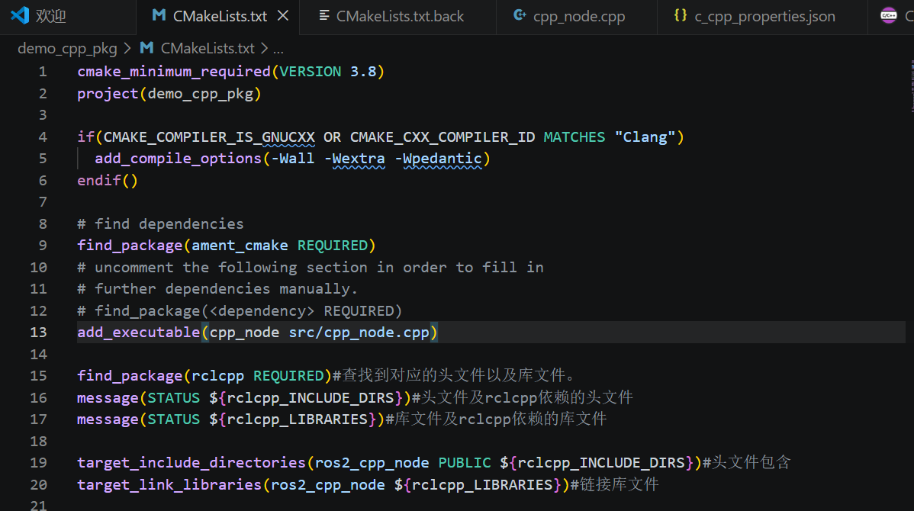
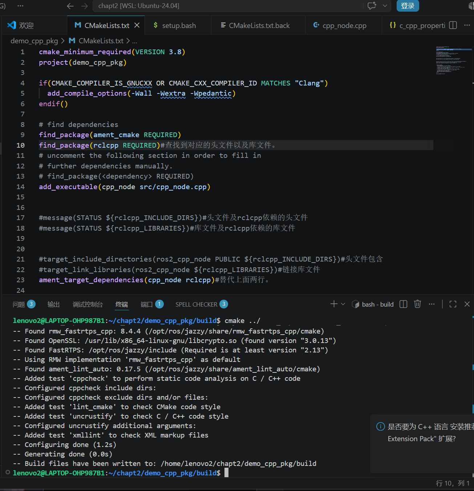
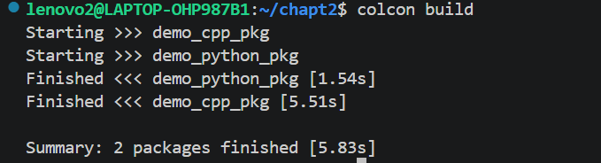
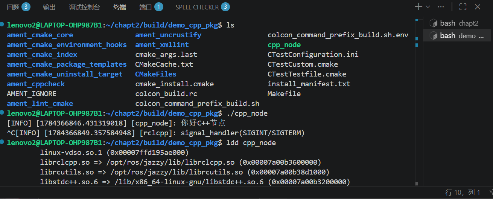
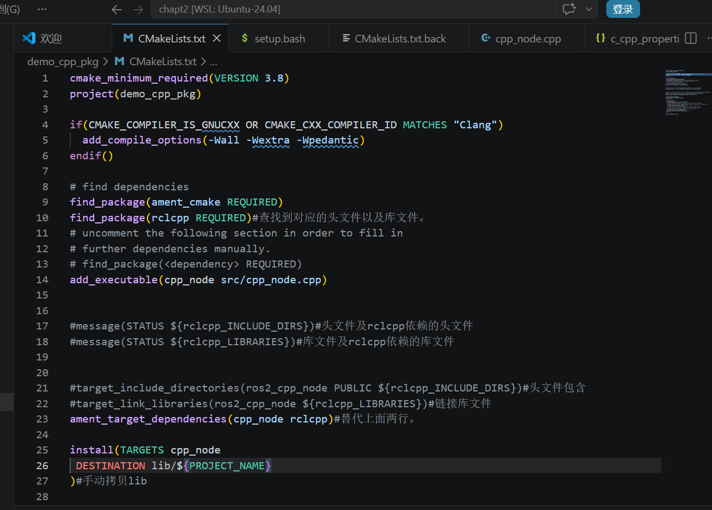
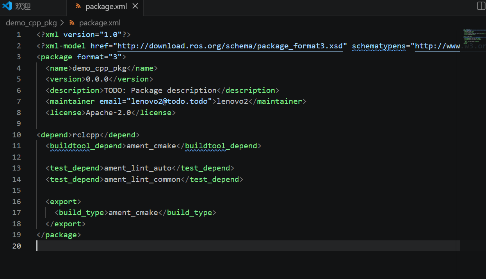
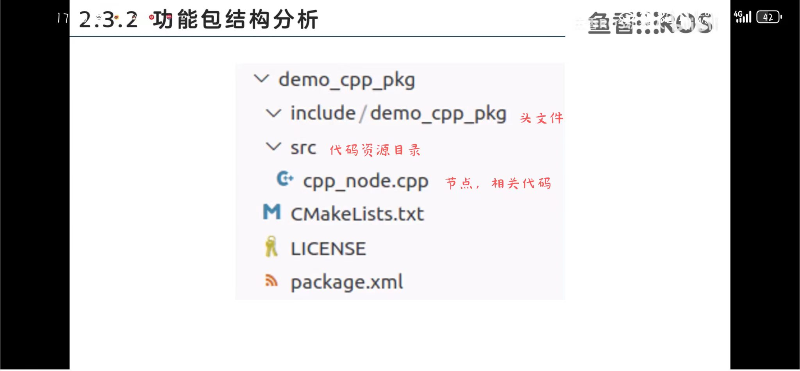

# 使用功能包组织C++节点。

## 1.构建功能包

      ros2 pkg create --build-type ament_cmake --license Apache-2.0 demo_cpp_pkg

## 2.在demo_cpp_pkg/src新建文件cpp_node.cpp

## 3.修改CMakeLists.txt

在/home/lenovo2/chapt2/demo_cpp_pkg/CMakeLists.txt中添加add--target的内容

简略版：

## 4.新建build，建立可执行文件。

     cd demo_cpp_pkg

     mkdir build

     cd build

     cmake ../

     make

     ./cpp_node

     ctrl+C 退出

一行一行输

## 5.构建

查看cpp_node依赖那些库以及有没有链接上

      ldd cpp_node 

## 6.ros2 run demo_cpp_pkg cpp_node运行

手动拷贝lib

      source install/setup.bash

     colcon build

     ros2 run demo_cpp_pkg cpp_node

## 7.添加依赖声明。

chapt2/demo_cpp_pkg/package.xml中

     <depend>rclcpp</depend>

## 8.功能包分析。

