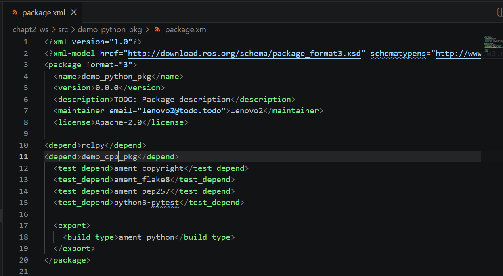
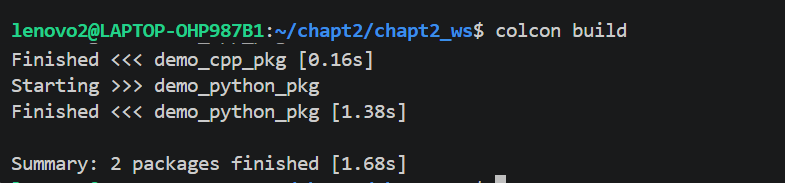

# 构建多功能包

**一个完整的机器人项目往往由多个不同的功能模块组成，所以对它们进行组合——工作空间。**

一个典型的 ROS 2 工作空间（就是一个文件夹）至少会包含： 
• src/：存放源代码包的文件夹（重要） 
• build/：构建过程中产生的中间文件 
• install/：安装后的可执行文件与环境脚本 
• log/：构建日志

**过程**

创建双重文件夹。

      mkdir -p chapt2_ws/src

拷贝

      mv demo_cpp_pkg/ chapt2_ws/src/

      mv demo_python_pkg/ chapt2_ws/src/

删除

      rm -rf build/ install/ log/

构建

      cd chapt2_ws/

      colcon build

只构建一个 

      colcon build --packages-select demo_cpp_pkg

如果先构建cpp构建python，在python中添加依赖

