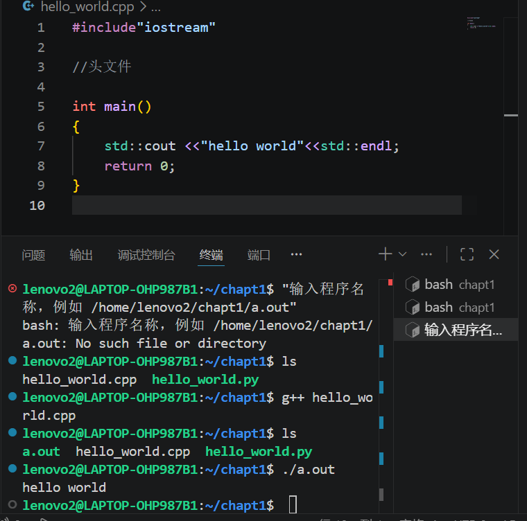
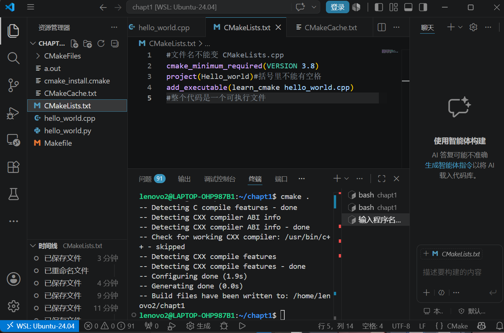
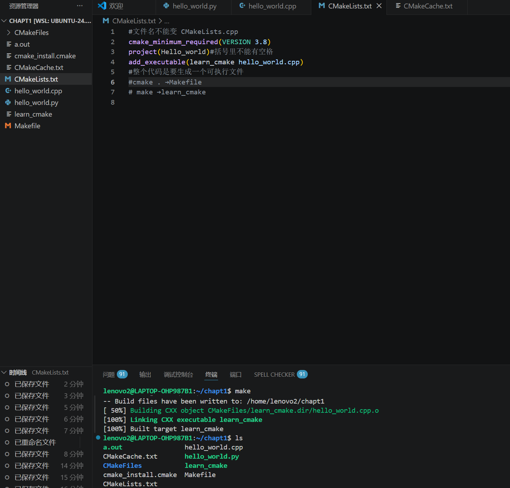
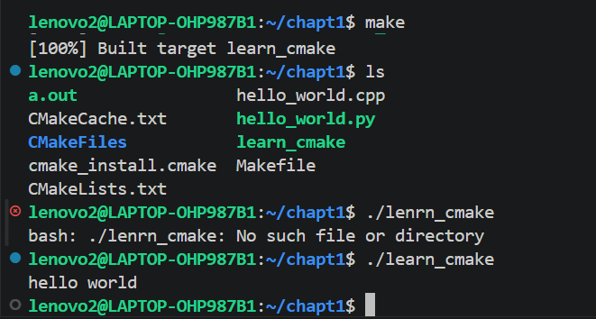

# 在Linus中编写C++代码

## 1.编写文件

新建一个文件，文件名称为hello_world.cpp

内容如下：

## 2.编译

     g++ hello_world.cpp

## 3. ls 可以看到有一个a.out的可执行文件。

     ls

## 4.  ./a.out 执行文件

     ./a.out

     
- 可以看出上面图片最终答应出了hello world

## 5.用cmake执行C++

**创建文档CMakeLists.txt**

内容如下：

**CMake . 就可以把他打包成一个可执行文件Makefile**

     CMake .

**make 构建可执行文件learn_cmake**

     make

**./learn_cmake 执行文件**

     ./learn_cmake 

